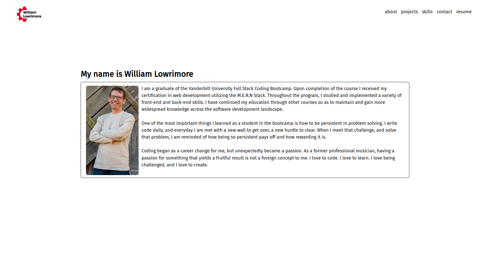
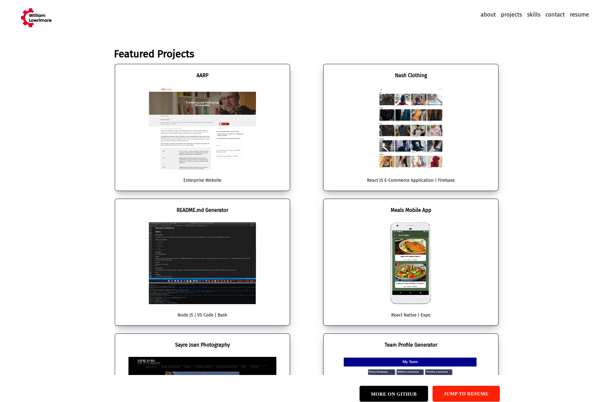
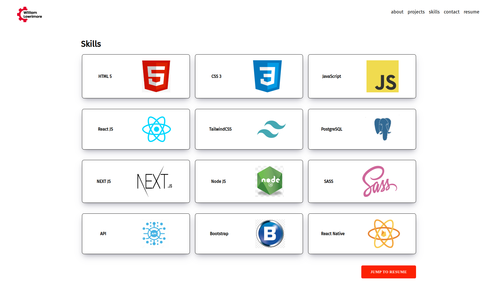
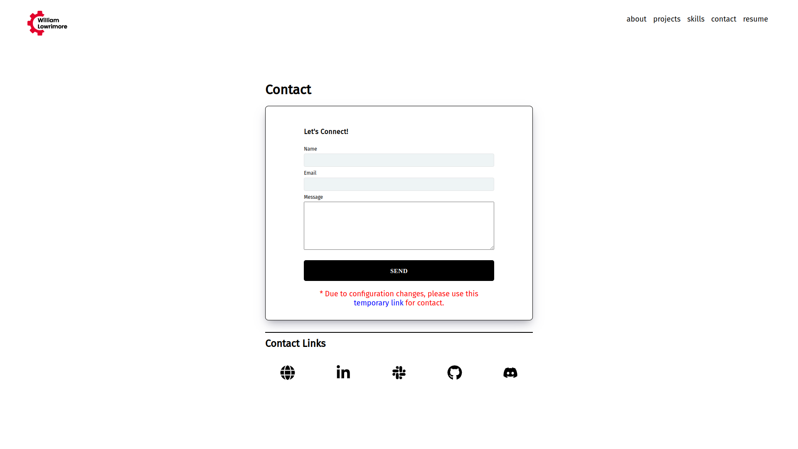
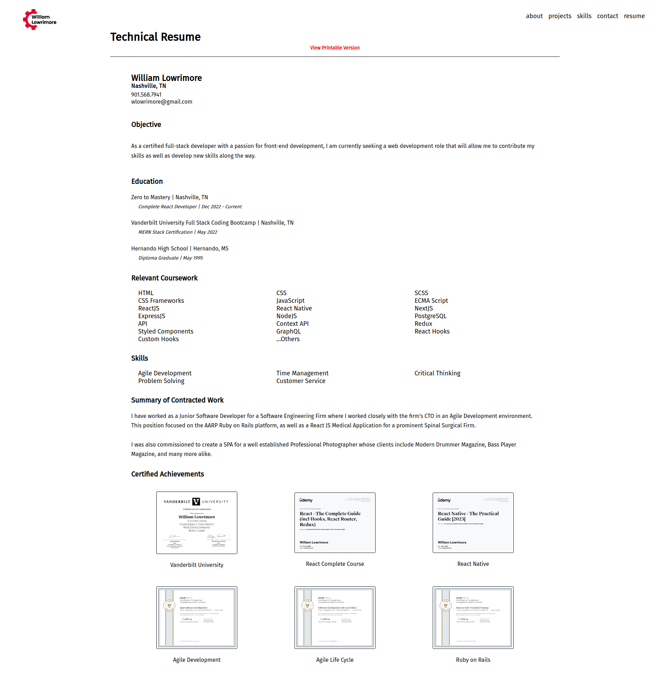

# William Lowrimore 2023 Portfolio

## Description:
This is my updated Portfolio which includes my technical resume.  This is a React JS application that uses Styled Components and React Router V6. The live site can be found at: 

<a href='https://www.williamlowrimore.com' target='_blank' rel='noreferrer'>www.williamlowrimore.com</a>

## Licensed by:
MIT

## Contact:
<a href='mailto: wlowrimore@gmail.com' target='_blank' rel='noreferrer'>wlowrimore@gmail.com</a> 
<a href='https://www.linkedin.com/in/william-lowrimore-21778310' target='_blank' rel='noreferrer'>www.linkedin.com</a> 
<a href='https://www.wlowrimore.slack.com' target='_blank' rel='noreferrer'>www.slack.com</a>  

<h4>&copy; 2023 All Rights Reserved William Lowrimore</h4>